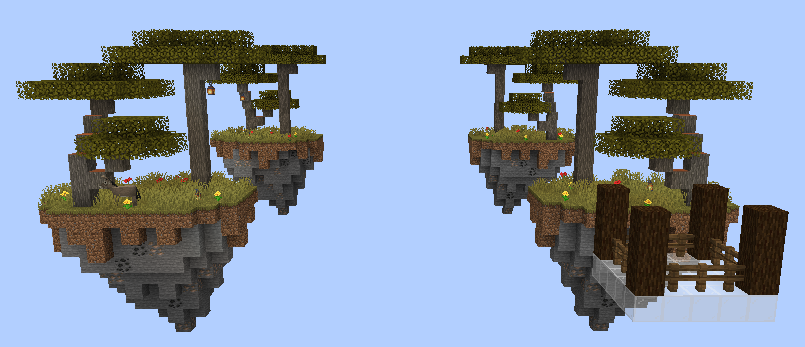

# Bedwars Savanna

> A savanna-themed Minecraft map for my [Bedwars plugin](https://github.com/esotericenderman/bedwars).

## Features

- 4 islands, 1 for each team
- Savanna biome theme
- Acacia tree on each island
- Coal and iron ores in the islands
- Compatible with my [Bedwars plugin](https://github.com/esotericenderman/bedwars)

See the [Bedwars plugin](https://github.com/esotericenderman/bedwars) page for more information.

## Story

I created this map as part of a [Udemy course](https://www.udemy.com/course/develop-minecraft-plugins-java-programming/) by [Stephen](https://github.com/stephendotgg) for the [minigame section](https://www.udemy.com/course/develop-minecraft-plugins-java-programming/learn/lecture/30007374).

## License

  &copy; 2024-2025 <a rel="cc:attributionURL dct:creator" property="cc:attributionName" href="https://enderman.dev">Esoteric Enderman</a>

  <a property="dct:title" rel="cc:attributionURL" href="https://github.com/esotericenderman/bedwars-savanna">Bedwars Savanna</a> is licensed under <a href="https://github.com/esotericenderman/bedwars-savanna/blob/main/LICENSE" target="_blank" rel="license noopener noreferrer" property="cc:license" style="display: inline-block">CC BY-SA 4.0</a>.

  

## Disclaimer

NOT AN OFFICIAL MINECRAFT PRODUCT. NOT APPROVED BY OR ASSOCIATED WITH MOJANG OR MICROSOFT.

## Topics

[minecraft](https://github.com/topics/minecraft), [minigames](https://github.com/topics/minigames), [minigame](https://github.com/topics/minigame), [minecraft-minigames](https://github.com/topics/minecraft-minigames), [minecraft-map](https://github.com/topics/minecraft-map), [minecraft-map-making](https://github.com/topics/minecraft-map-making), [minecraft-minigame](https://github.com/topics/minecraft-minigame), [minecraft-world](https://github.com/topics/minecraft-world), [minecraft-worlds](https://github.com/topics/minecraft-worlds), [minecraft-maps](https://github.com/topics/minecraft-maps)
